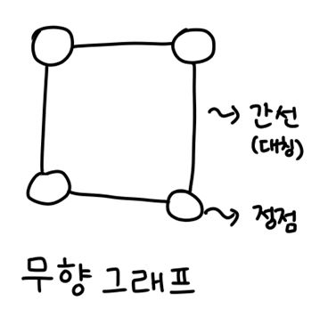
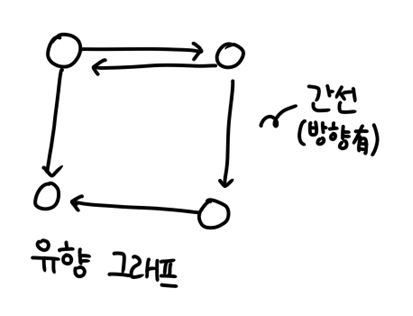
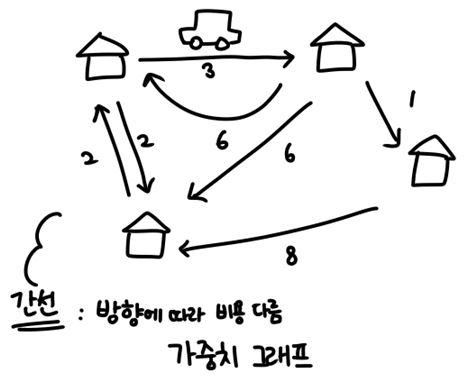
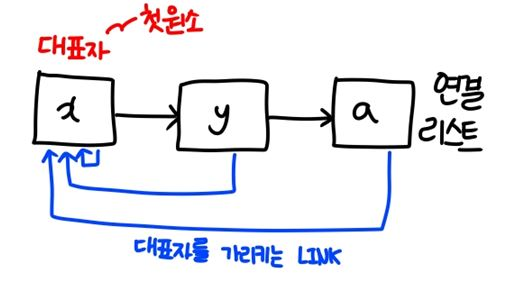
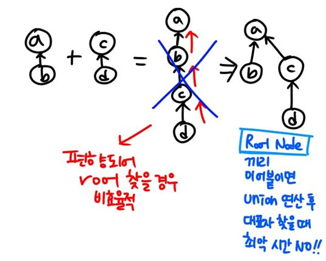
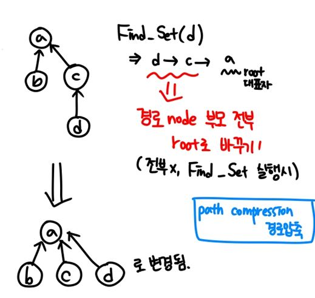

made_by_blessisu

# Graph

### 1. graph

> 정점(Vertex)과 간선(Edge)의 집합으로 구성된 자료구조

객체(사물 혹은 추상적 개념)들과 객체들 사이의 "연결 관계"를 표현함

정점은 객체를 나타내고, 간선은 정점들 사이의 관계를 나타냄.

- 최대 간선의 개수는 `정점*(정점-1) / 2` : Undirected graph(symmetrical)

  Why? 한 점을 정하고, 이을 점을 정하면 되기 때문. / 2를 해주는 건 두 정점에 대해 a -> b, b -> a 같은 간선이 두 번 나타나기 때문

주로 선형 자료구조나 트리 자료구조로는 표현하기 어려운 N:N 관계를 갖는 원소들을 표현하는데 이용된다.


### 2. graph의 종류

#### 무향 그래프 (Undirected Graph)



- symmetrical : True
- 1 --- 2 인 경우
  - 서로 인접(Adjacency)해 있음 
  - 1번 정점은 2번 정점의 인접 정점
  - 2번 정점은 1번 정점의 인접 정점 


#### 유향 그래프 (Directed Graph)



- symmetrical : False
- 간선을 화살표로 표현하여 방향성의 개념을 포함
- ex) 기업의 공급관계, 작업의 선후 관계 등을 표현
- 1 ---> 2 인 경우
  - 2번 정점이 1번 정점의 인접 정점 


#### 가중치 그래프 (Weighted graph)



- symmetrical : False
- 이동하는데 드는 비용을 간선에 부여한 그래프
- 정점이 같더라도 방향에 따라 비용이 다를 수 있음
- ex) 비용은 주로 거리, 시간, 금액 등을 표현


#### 완전 그래프

> 임의의 모든 정점이 모두 인접해 있는 그래프

#### 부분 그래프

> 원래 그래프에서 일부의 정점이나 간선을 제외한 그래프


### 3. 경로

#### 경로

> 간선들을 순서대로 나열 한 것

#### 단순 경로

> 경로 중 한 정점을 최대한 한 번만 지나는 경로

#### 사이클 (cycle)

> 시작한 정점에서 끝나는 경로

특히, 사이클이 없는 유향 그래프 (Directed Acyclic Graph) 를  DAG로 표기


### 4. graph 표현

> 컴퓨터에서 그래프 표현

- **간선의 정보**를 저장하는 방식
- 메모리, 성능을 고려해 결정


#### 인접 행렬 (Adjacent matrix)

NxN 크기의 2차원 리스트를 이용하여, 간선의 정보를 저장

두 정점을 연결하는 간선의 유무를 "행렬"로 표현

- 무향 그래프에서

  인접 되어있으면 1 아니면 0

  즉 `Adjacent_matrix[2][4] = 1` 이라면 4는 2의 인접정점이다.

- 유향 그래프에서

  간선의 수가 1로 표현됨

  i 행에 존재하는 총 1의 개수 == i 정점의 진출차수 (i 에서 출발)

  j 열에 존재하는 총 1의 개수 == j 정점의 진입차수 (j 에 도착)

  

> 단점 

- 정점의 개수 n이 커질수록 인접 행렬에 필요한 메모리 크기 n^2^에 비례하여 커

  (특히 0이 많은 경우 더욱 비효율적)

  또한 특정 정점의 인접 정점을 찾을 때마다 n 개의 메모리 슬롯을 확인해야 함

> 극복

1. (정점에 비해) 간선의 수가 많지 않을 경우,

   메모리 사용을 줄이기 위해 아래처럼 간선들의 정보를 나열하여 저장함.

| 인덱스 | 시작정점 | 끝정점 |
| ------ | -------- | ------ |
| 0      | 0        | 1      |
| 1      | 0        | 2      |
| 2      | 4        | 3      |
| 3      | 5        | 7      |

2. 인접 리스트로 표현


#### 인접 리스트 (Adjacent List)

각 정점마다, 인접 정점으로 나가는 간선의 정보 저장

ex) 1 → 2 일 때, 1에 2를 저장

- 각 정점에 대한 인접 정점들을 순차적으로 표현
- 하나의 정점에 대한 인접 정점을 각각의 노드로 하는 연결 리스트로 저장

> 장점

- 불필요한 메모리 낭비를 줄임
- 인접 정점을 찾는 비용을 줄일 수 있음


1. 정점의 개수만큼 메모리 주소를 저장하는 리스트 존재
2. 리스트에는, 연결되는 첫 노드의 주소를 저장한다.


3. 연결된 노드에, 정점에 연결된 또다른 노드의 주소를 저장한다


==즉, 정점을 표현하는 리스트에 정점이 갖는 인접 정점의 주소를 저장하며 계속 연결해 나간다.== 따라서 인접 정점의 수만큼, 해당 정점에 연결 리스트가 존재하게 된다.


 ### 5. graph 탐색

#### 그래프 순회

##### 깊이 우선 탐색 (DFS : Depth First Search)

1. 시작 정점에서 갈 수 있는 한 방향을 선택해서 다음 정점으로 이동

2. 선택된 정점에서 1번을 반복하면서, 갈 수 있는 최대의 경로까지 깊이 탐색

   (단 여기서, 이미 방문했던 정점 재방문X)

3.  더 이상 갈 곳이 없다면, 가장 최근에 방문한 갈림길이 있는 정점으로 돌아와서 다른 방향을 탐색하며 반복 작업

- `즉 모든 정점을 방문`
- `가장 마지막에 만났던 갈림길로 되돌아감`
- `LIFO` 마지막에 넣은 것부터 pop 하는 구조 필요 --> `stack` 사용 혹은 `재귀` 구현

> 재귀로 구현한 DFS

````python
# G: 그래프 v: 시작정점
# visited: 방문 정보 표시 [False로 초기화되어있음]
# G[v] v의 인접 정점 리스트
def DFS_Recursive(G,v):
    visited[v] = True
    visit(v) # 원하는 작업. cnt += 1을 한다던가, 기타 작업이 올 수 있음
    for w in G[v]: # 인접 정점에 방문!
        if not visited[w]: # 방문 아직 안한 경우 실행
            DFS_Recursive(G,w)
            # 선택된 점과 인접한 점 --> 즉 점점 깊은 곳으로!
            # 만약 더이상 깊은 점이 없다면 바로 전 갈림길로 돌아가서
            # 또 깊게 들어갈 수 있나 확인함
````


> 반복문으로 구현한 DFS

```python
# G: 그래프, S: 스택, v: 시작 정점
# visited: 방문정보 표시 --> 방문한 점을 append
# G[v] v의 인접 정점 리스트
def DFS_iterative(S, v):
    S = [v]
    while S:  # 스택이 빌 때까지 반복
        v = S.pop()
        if v not in visited:
            visited.append(v)
            visit()
            S.extend(G[v] - set(visited))  
        # 방문하지 않은 정점 중에서, 방문하지 않은 정점들을 스택에 저장
	return visited # 방문한 순서대로 visited에 저장되어 있음
```


##### 너비 우선 탐색 (BFS : Breadth First Search)

1. 탐색 시작점의 인접한 정점들을 모두 차례로 방문

2. 방문한 점을 시작지점으로, 1번 과정인 인접 정점 모두 방문을 반복

   (visited 된 점은 제외)

- 시작 지점에 대한 인접 정점부터 모두 방문! : 너비 우선 탐색
- `FIFO` 맨 처음에 넣은 것부터 살펴보자 --> `queue`를 사용

> list를 queue로 이용하여 반복문으로 구현한 BFS

```python
# G: 그래프, Q: 큐, V: 시작정점
# visited : 방문 정보 표시
# G[v] v의 인접 정점 리스트
def BFS(Q, v):
    Q.append(v)
    visited[v] = True
    visit(v)  # cnt를 늘리거나하는 정점을 방문하면서 해야할 행동
    while Q:
        v = Q.pop(0)  # 먼저 넣은 걸 먼저 살펴보기!! 이게 BFS
        for w in G[v]:
            if not visited[w]:
                Q.append(w)
                visited[w] = True
                visit(w)
```


> 위 코드를 확정해서, 방문 거리까지 q에 넣어 확인하는 방법

````python
# G: 그래프, Q: 큐, V: 시작정점
# visited : 방문 정보 표시
# G[v] v의 인접 정점 리스트
def BFS(Q, v):
	D[v] = 0  # 거리값 0
	P[v] = v  # 최단 경로 트리를 저장하는 리스트. 시작점
    # 부모 노드를 저장함
    Q.append(v)
    visited[v] = True
    visit(v)  # cnt를 늘리거나하는 정점을 방문하면서 해야할 행동
    while Q:
        v = Q.pop(0)  # 먼저 넣은 걸 먼저 살펴보기!! 이게 BFS
        for w in G[v]:
            if not visited[w]:
                Q.append(w)
                visited[w] = True
                visit(w)
                D[w] = D[v] + 1  # w의 거리는 v의 거리 + 1
                P[w] = v  # w의 부모 노드를 v로 설정
                # 즉 P에는 어떤 것을 타고왔는지, 부모노드가
                # D에는 w까지오는 최단 경로(간선의 수)가 저장되어있음
````


> 가중치가 1이 아닐 경우 DFS

가중치가 1이라면 D에 저장된 값이 최단 경로이고, 그렇지 않은 경우는 P에 저장된 부모 정보를 타고가면서 root node(부모 노드가 자기 자신인 값)를 찾을 때 까지 타고 가며 간선의 수를 확인하면 된다.


### 6. 상호 배타 집합

#### 서로소 혹은 상호배타 집합들

> 서로 중복 포함된 원소가 없는 집합. 즉 교집합이 없음

- 집합에 속한 하나의 특정 원소를 통해 각 집합들을 구분 : `대표자`
- 표현 방법 : 연결 리스트, 트리


#### 상호배타 집합 연산

- Make-Set(x) : 원소 x만으로 구성된 집합을 생성하는 연산

  -- > 이 경우 원소가 하나이므로, 자신이 집합의 대표자가 됨

- Find-Set(x) : 임의의 원소 x가 속한 집합을 알아내기 위함.

  ​					집합의 대표자를 알기위한 연산

  ​					x가 속한 집합의 대표자를 찾음

- Union(x, y) : x 원소가 속한 집합과 y 원소가 속한 집합을 합하는 합집합 연산

  ​					x 집합의 대표자를 최종 대표자로 선택함

- 애초에 교집합이 존재하는 집합들이므로, 교집합 연산은 존재하지 않음


#### 연결 리스트 표현

- 같은 집합의 원소들은 하나의 연결 리스트로 !
- 연결 리스트의 첫 번째 원소를 집합의 대표 원소로 선택
- 각 원소는 집합의 대표원소를 가리키는 링크를 가짐




- 집합들을 Union 할 때는, ==큰 집합 뒤에 작은 집합을 연결==한다.
- why? Union 하면 ==대표자 LINK를 전부 수정해야하는데, 해당 연산을 줄이기 위해==


#### 효율적인 처리방법 - Tree

> 하나의 집합(a disjoint set)을 하나의 트리로 표현

- 자식 노드가 부모 노드를 가리키며, 루트 노드가 대표자 역할

  

##### Tree에서 상호배타 집합 연산

- Make-Set(x) : 자신을 root 로 하는 Tree 생성

- Union(x, y) : x가 속한 집합의 대표자를  y가 속한 집합의 대표자의 부모 노드가 되게 한다

- Find-Set(x) : 최종 부모 노드가 나올 때까지, x의 부모 노드를 타고, 그의 부모 노드를 타고... 즉 root node를 찾는다. (자기 자신을 부모로 갖는 원소를 찾을 때 까지)

  

##### 상호배타 집합을 트리로 표현

각 원소의 부모에 대한 정보를 저장하고, 부모가 자기 자신이 되면 집합의 대표자가 됨.

| 원소 | 0    | 1    | 2    | 3    | 4    |
| ---- | ---- | ---- | ---- | ---- | ---- |
| 부모 | 0    | 1    | 2    | 2    | 3    |

---> 해당 표를 보면, 0과 1은 각각 한 집합의 대표자라는 것을 알 수 있다.


> Make-Set(x), Find-Set(x), Union(x, y) 기본 알고리즘

````python
def Make_Set(x):
	p[x] = x  # x만을 원소를 갖는 집합 
    

def Find_Set(x):
    if x == p[x]:
        return x
    else:
        Find_Set(p[x])

        
def Union(x, y):
    p[Find_Set(y)] <- Find_Set(x)
````


> Tree로 표현 시 문제점?

집합을 union 하는 과정에서 편향된 트리 구조를 생성될 수 있음.

--> 이 경우, root node를 찾는데(대표자) 간선의 수 만큼 재귀 호출이 필요하다.

--> 모든 원소들이 root를 부모로 가리키도록 tree를 만들면 된다.


> 연산 효율 향상 방법

1. Rank를 이용한 Union

   1. 각 노드는 자신을 root로 하는 subtree의 높이를 rank라는 이름으로 저장한다.
   2. 두 집합을 union할 때 rank가 낮은 집합을 rank가 높은 집합에 붙인다
   3. 이 때, 높이가 같은 tree를 합치면 rank가 증가하게 됨을 주의한다.

   

   

2. Path compression 경로 압축

   - Find-Set 을 행하는 과정에서 만나는 모든 노드들이 직접 Root를 가리키도록, 부모 정보를 모두 바꿔주기

   


> 효율성을 개선한 Make-Set(x), Find-Set(x), Union(x, y) 알고리즘

````python
# p[x] 는 x의 부모를 저장하는 list
# rank[x] 는 루트 노드가 x인 트리의 랭크(레벨) 저장
def Make_Set(x):
	p[x] = x
    rank[x] = 0
    

def Find_Set(x):
    if x != p[x]:  # x가 root 가 아닌 경우
        p[x] = Find_Set(p[x])
        # x의 부모인 p[x]에서, p[x]의 부모인 Find_Set(p[x]),
        # 즉 p[p[x]]를 가리키도록 갱신함
        # 이를 반복하면 path compression
    return p[x]  # 대표자 리턴

        
def Union(x, y):
    # 랭크 값이 낮은 트리를, 높은 트리의 subtree로 합치기
    Link(Find_Set(x), Find_Set(y))  # 두 트리의 rank를 비교하는 함수
    

def Link(x, y):
    if rank[x] > rank[y]:
        p[y] = x  # x의 랭크가 더크면, y의 부모를 x로 설정.
                  # 즉 rank가 작은 y를 x의 subtree로 설정
    else:
        p[x] = y  # 만약 y의 랭크가 크거나 같다면,
                  # y의 subtree 로 x를 넣고
    if rank[x] == rank[y]:
        rank[y] += 1
        # 랭크가 같은 경우는 최종 부모노드인 y의 rank를 1증가시킴
        # rank값이 같은 경우는 x, y 중 어디로 합칠 건지 사실 무방함.
    
````


> 상호배타 집합 연산의 장점

- 구현이 간단하고, 동작 속도가 빠르기 때문에 그래프 영역에서 많이 이용되고 다른 알고리즘의 일부로 사용함
  - 특히 ==그래프의 연결성 확인==!! : 임의로 제시된 두 마을이 연결되었는지 확인
  - KRUSKAL Minimum Spanning Tree(MST) : 최소 신장 트리 알고리즘에 쓰임

- 각 집합에 속한 원소의 수 관리 (합쳐 질 때마다, 노드 개수 갱신)
  - 가장 큰 집합 추적
  - 집합의 노드 개수가 몇 개 이상이 되는 시점 찾기 등에 이용 가능