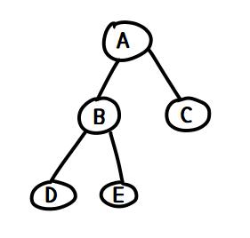
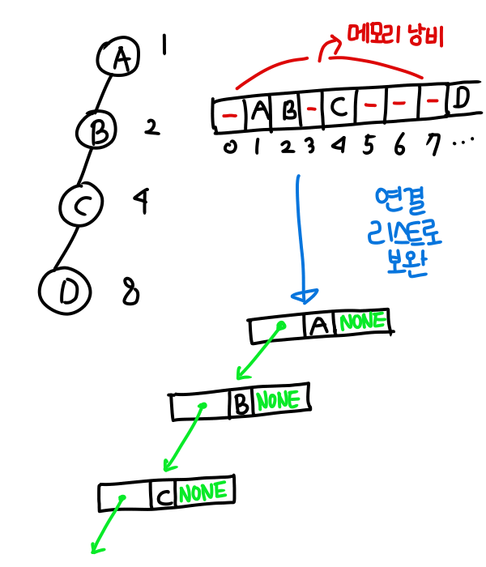
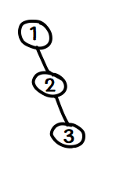

# Tree

### Tree

> 비선형 구조로 원소들 간에 1:N 관계를 가지는 자료구조

원소들 간에 계층관계를 갖는 "계층형" 자료구조

상위 원소에서 하위원소로 내려가면서 확장되기 때문에 Tree 모양 구조라고 함.

- 한 개 이상의 노드로 이루어진 유한 집합

- ==ROOT== NODE : 최상위 노드

- ==LEAF== NODE : 자식 노드가 없는 최하단 노드

- 나머지 노드들을 N개의 분리집합으로 분리할 수 있는데, 이는 각각이 하나의 트리가되며 이를 ROOT의 **Sub Tree** 라고한다. `Recursive`

  

### 트리의 구성요소

>  NODE (노드) 와 EDGE (간선)

- NODE : 트리의 원소
- EDGE : 노드를 연결하는 선이며, 부모 노드와 자식 노드를 연결함

1. Root NODE : 트리의 시작 노드
2. Sibling NODE : 같은 부모의 자식 노드들
3. Ancestor NODE : 간선을 따라, 루트 노드까지 이르는 경로에 모든 노드
4. SubTree : 부모 노드와 연결된 간선을 끊었을 때 생기는 트리
5. Descendent NODE : SubTree에 있는 하위 레벨의 모든 노드

- Degree (차수) : 노드에 연결된 자식의 노드 수 (자손 아님 주의!)
- 트리의 Degree : 트리의 노드의 차수 중, 가장 큰 값
- 단말 노드 (혹은 Leaf Node) : 차수가 없는 노드
- 높이 : 노드의 레벨. 루트에서 노드에 이르는 간선의 수. 주로 Root 의 높이를 0으로하고 아래로 내려오면서 1 씩 증가함. (문제에 따라 높이가 1부터 시작하는 경우도 있음)
- 트리의 높이 : 트리에 노드 중 높이가 가장 깊은 값


### Binary Tree

>  모든 노드들이 2개의 SubTree를 갖는 특별한 형태의 트리

노드가 자식 노드를 최대한 2개까지만 가질 수 있어 자식노드를 두개로 나눔

- Left Child Node
- Right Child Node

레벨이 i 일때 노드의 최대 개수 2^i^ 개 --> 즉 한 줄에 있을 수 있는 노드의 개수가 레벨 i 일 때 2^i^ 라는 것. 

높이가 h 인 이진 트리가 가질 수 있는 노드의 최소 개수는 (h+1) 개 (1자로 내려 왔을 때), 최대 개수는 2^h+1^ - 1 개 


### Binary Tree 의 종류

1. Full Binary Tree (포화 이진 트리)

   모든 레벨의 노드가 포화상태로 차 있는 이진 트리. 즉 최대 노드의 개수 2^h+1^ - 1 개의 노드를 갖는다.

   따라서 노드 번호가 1, 2, 3, 4, ... , 2^h+1^ - 1 순서대로 갖는다.

   

2. Complete binary Tree (완전 이진 트리)

   높이가 h고 노드가 n개 일 때

   완전 이진 트리의 노드번호 1번부터 n번까지 빈자리가 없는 이진 트리를 뜻함


3. Skewed binary Tree (편향 이진 트리)

   높이 h에 대해 최소 개수의 노드를 갖고, 한쪽 방향의 자식 노드만 갖는 이진 트리

   


### Tree Traversal (트리 순회)

트리의 각 노드를 중복되지 않게 전부 방문하는 것

비선형 구조로, 선후 연결 관계를 알 수 없기 때문에 특별한 방법이 필요함

> 전위 순회, 중위 순회, 후위 순회

L (왼쪽 서브트리) R (오른쪽 서브트리) V(루트노드)

1. Preorder Traversal

   VLR, 자손노드보다 루트노드를 먼저 방문

   ```python
   def preorder_traverse(T): # 전위 순회
       if T: # T is not None
           visit(T)
           preorder_traverse(T.left)
           preorder_traverse(T.right)
   ```

   

   순회 순서 : A B D E C

   첫 방문 점은 루트 노드임

   

2. Inorder Traversal

   LVR, 왼쪽자손, 루트, 오른쪽 자손 순으로 방문

   ````python
   def inorder_traverse(T):
       if T:
           inorder_traverse(T.left)
           visit(T)
           inorder_traverse(T.right)
   ````

   

   순회 순서 : D B E A C

   즉, 첫 방문점이 왼쪽 맨 아래 노드임.

   

3. Postorder Traversal

   LRV, 루트노드보다 자손을 먼저 방문

   ````python
   def postorder_traversal(T):
       if T:
           postorder_traversal(T.left)
           postorder_traversal(T.right)
           visit(T)
   ````

   

   순회 순서 : D E B C A

   첫 방문점은 왼쪽 맨 아래 노드, 마지막 방문점이 루트 노드.


### Expression Tree

List 혹은 Linked List 사용하여 표현함

>  리스트를 이용한 이진 트리 표현

1. 이진 트리에 각 노드 번호를 부여

2. 루트 번호는 1

3. 레벨 n에 있는 노드에 대하여 왼쪽부터 오른쪽으로 2n부터 2^n+1^ -1 까지 차례대로 번호 부여

   - 노드 번호가 i 인 노드의 부모 노드의 번호는 `i//2`

   - 노드 번호가 i 인 노드의 왼쪽 자식 노드 번호는 `2*i`, 오른쪽은 `2*i + 1`

     

- 노드 번호를 인덱스로 표현

1. 높이가 h인 이진 트리의 리스트의 크기? : 2^h+1^ 만큼 할당 시, index 1부터 사용가능

   레벨 i의 노드 최대 수 :  2^i^

   모든 레벨의 노드 수 합 : 2^h+1^ -1 


- 단점

  편향 이진 트리와 같은 경우, ==사용하지 않는 리스트 원소에 대한 메모리 공간 낭비==가 발생함. 이를 보완하기 위해 ==연결 리스트== 를 사용하여 트리를 표현하기도 함. 특히 이진 트리의 모든 노드는 최대 2개의 자식 노드를 가지므로, 단순 연결 List 노드를 사용하여 구현함.




### Binary Search Tree

- 탐색 작업을 효율적으로 하기 위한 자료구조

- 모든 원소는 서로 다른 유일한 키 값을 가짐

  - key(left) < key(root) < key(right)

  - 따라서 중위 순회 시 오름차순으로 정렬된 값을 얻을 수 있음.

    

> ==키 값 찾는 방법== 

- 찾으려는 키 값이 x 라고 할 때

1. x == 루트 노드 값 ?? --> 맞으면 탐색 성공 ! 
2. 만약 아니라면?
   1.  x < 루트 노드 (x가 루트 노드보다 작다면) 왼쪽 서브 트리 탐색
   2. x > 루트 노드 (x가 루트 노드보다 크다면) 오른쪽 서브 트리 탐색
3. 1 번 다시 실행


>  ==삽입 연산==

1. 키 값을 서칭하여 트리에 있는지 확인
2. 탐색 실패 시 결정되는 위치 == 삽입 위치


> 성능

- 탐색, 삽입, 삭제 시간 : 트리의 높이 h에 대해 O(h)

- 이진 트리가 균형적인 경우 : O(log n)

- 최악의 경우 : ==한쪽으로 치우친 경사 이진 트리== O(n) 

  최악의 경우, 순차 탐색과 시간 복잡도가 같다.


### 검색 알고리즘 시간 비교

1. 리스트에서 순차 검색 : O(N)

2. 정렬된 리스트에서 순차 검색 : O(N)

3. 정렬된 리스트에서 이진 검색 : O(logN)

4. 이진 탐색 트리에서 평균 : O(logN)

   최악의 경우 : O(N)

   최악의 경우는 아래 사진과 같은데, 트리의 높이 값이 n과 가까워 지기 때문에 O(N)의 시간을 갖게 됨.

   

   ==완전 이진 트리, 균형 트리로 바꿀 수 있다면 최악 면할 수 있음==

   - 새로운 원소 삽입할 때 삽입 시간 감소
   - 평균과 최악의 시간 모두 O(logN)

5. 해쉬 검색 : O(1)

   - but 해쉬를 저장할 메모리 필요


### Heap

완전 이진 트리의 응용.

완전 이진 트리에 있는 노드 중에서 키 값이 가장 큰 노드나, 키 값이 가장 작은 노드를 찾기 위해서 만든 자료구조

> Max Heap

키 값이 가장 큰 노드를 찾기 위한 완전 이진 트리

- 부모 노드의 키값 > 자식 노드의 키값
- 루트 노드 : 키 값이 가장 큰 노드

> Min Heap

키 값이 가장 작은 노드를 찾기 위한 완전 이진 트리

- 부모 노드의 키 값 < 자식 노드의 키값

- 루트 노드 : 키 값이 가장 작은 노드

  

> 삽입 연산

1. 비어 있는 곳에 임시로 삽입
2. 부모 노드와 비교하며 위치 바꾸기를 반복

> 삭제 연산

1. 루트 노드의 원소만을 삭제 가능

2. 따라서 루트 노드 원소 삭제

3. 마지막 노드를 루트 노드 위치로 이동

4. 삽입된 노드와 자식노드 비교하면서 자리바꾸기

   

- 힙의 종류에 따라 최대값 혹은 최소값 구하기 가능

- heap에서의 삭제는 루트 노트를 삭제하는 것이므로,  우선 순위가 높은 것을 삭제한다는 것을 생각하면 heap을 통해 priority queue 구현 가능

- heap으로 priority queue를 구현하는 이유

  1. 리스트

     삭제 시간 O(1) / 삽입 시간 O(N)

  2. 연결 리스트

     삭제 시간 O(1) / 삽입 시간 O(N)

  3. 힙

     삭제 시간 O(logN) / 삽입 시간 O(logN)

